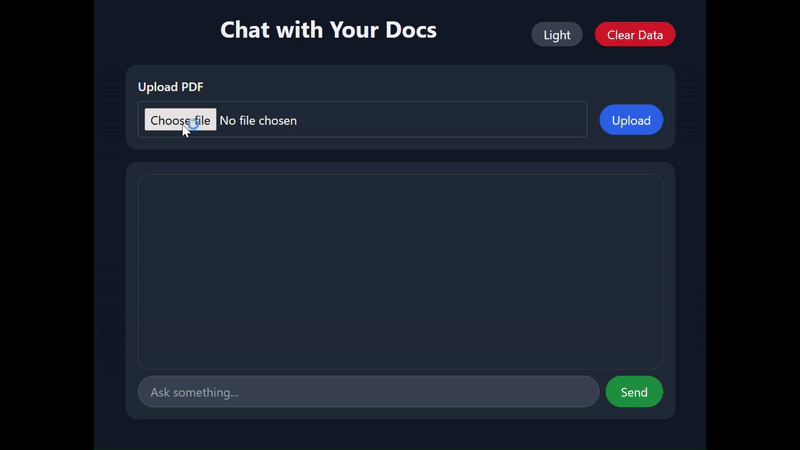

#  AI-Powered RAG-Based Document Chatbot with Pinecone & OpenAI  

**AI-Powered RAG-Based Document Chatbot with Pinecone & OpenAI** is a **Flask-based web application** that enables users to **upload PDF files** and chat with their documents using **Retrieval-Augmented Generation (RAG)**. It leverages **Pinecone Vector Store** and **OpenAI's GPT model** to retrieve the most relevant document information before generating AI-powered responses.  


---

##  Features  

-  **Upload PDFs** and extract text  
-  **RAG-based chatbot** for improved document-based Q&A  
-  **Store document embeddings** in Pinecone for fast retrieval  
-  **Retrieve and generate responses** using OpenAI GPT-4o  
-  **Clear stored vectors** anytime  
-  **Tailwind CSS-based UI** with animations  

---
## Installation & Setup  

### **1. Clone the Repository**  

```sh
git clone https://github.com/johnathikalam/easy_pdf.git
cd easy_pdf
```

### **2. Create a Virtual Environment**
```sh
py -3.10 -m venv venv
source venv/bin/activate   # On macOS/Linux
venv\Scripts\activate      # On Windows
```
### **3. Install Dependencies**
```sh

pip install -r requirements.txt
```
### **4. Set Up Environment Variables**
Create a .env file in the project root and add:

```ini
OPENAI_API_KEY=your_openai_api_key
PINECONE_API_KEY=your_pinecone_api_key
PINECONE_INDEX_NAME=your_pinecone_index
```
### **5. Running the Application**
Start the Flask server:

```sh
python flask_app.py
```
